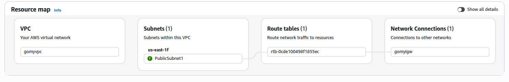
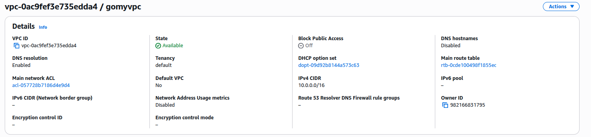
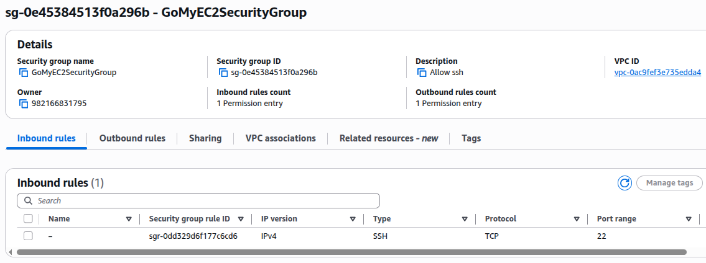
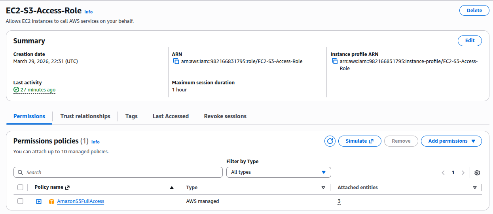
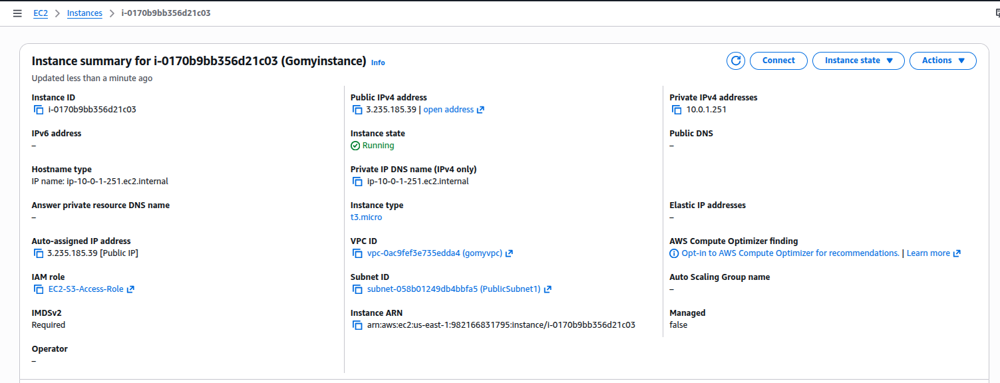
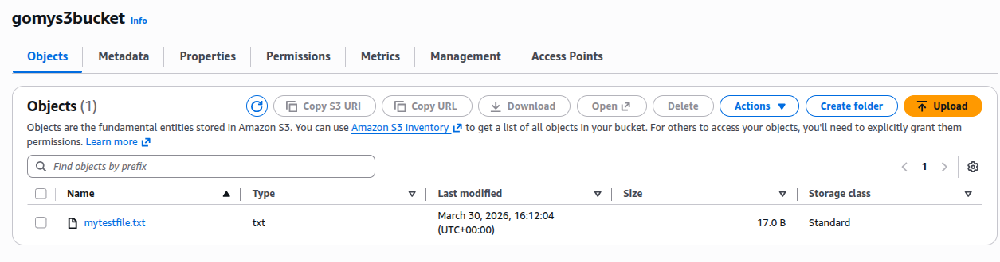

# AWS Cloud Project: Secure EC2 to S3 Integration

A hands-on demonstration of building a secure, custom AWS environment using **VPC networking**, **IAM Instance Profiles**, and **S3 storage**.

---

## 🏗 Infrastructure Overview

| Component | Resource Name |
| :--- | :--- |
| **VPC** | `gomyvpc` |
| **Subnet** | `PublicSubnet1` |
| **Security Group** | `GoMyEC2SecurityGroup` |
| **IAM Role** | `EC2-S3-Access-Role` |
| **S3 Bucket** | `gomys3bucket` |

---

## 🛠 Implementation & Deliverables

### 1. Networking & VPC Foundation
*   Created a custom VPC (`gomyvpc`) with a `10.0.0.0/16` CIDR block.
*   Provisioned `PublicSubnet1` and attached an **Internet Gateway**.
*   Configured **Route Tables** to allow outbound internet traffic.

**Proof:**



### 2. Security & Identity (IAM)
*   Configured `GoMyEC2SecurityGroup` to allow **SSH (Port 22)** only from my specific IP.
*   Created `EC2-S3-Access-Role` with S3 permissions.
*   Attached the IAM Role as an **Instance Profile** to the EC2 to avoid using static access keys.

**Proof:**



### 3. EC2 Instance Deployment
*   Launched an **Amazon Linux** instance into the `PublicSubnet1` of `gomyvpc`.
*   Assigned the `GoMyEC2SecurityGroup` to the instance for secure access.
*   Attached the `EC2-S3-Access-Role` during the launch process.
*   Successfully connected to the instance via **SSH** using a secure key pair.

**Proof:**


### 4. S3 Interaction (CLI)
Launched the instance and performed CLI operations to verify the IAM Role integration:

```bash
# Verify IAM Identity
aws sts get-caller-identity

# Create and Upload Test File
echo "Test data for S3" > mytestfile.txt
aws s3 cp mytestfile.txt s3://gomys3bucket/

# List Bucket Contents
aws s3 ls s3://gomys3bucket/
```

**Proof:**



---
